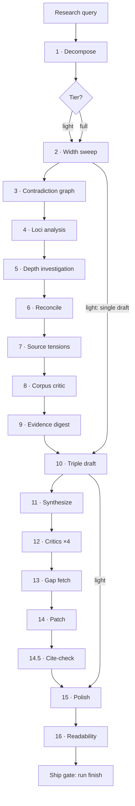

# Hyperresearch — Mimo-worker variant

One prompt in, adversarially-audited report out. A tier-adaptive 16-step
research pipeline where a Claude orchestrator sequences the work and small
models do the unit tasks: every worker runs on Xiaomi Mimo through LiteLLM
(`pool_mimo`), with tasks split small enough for reliable instruction
following. Forked from [jordan-gibbs/hyperresearch](https://github.com/jordan-gibbs/hyperresearch)
(v0.10.0) — see [upstream README](https://github.com/jordan-gibbs/hyperresearch#readme)
for the full CLI and vault reference.

## Pipeline map



Light tier runs 1 → 2 → 10 → 15 → 16 (~30–40 min). Full tier runs all 16
(~1.5–2.5 h). Dissertation (opt-in) loops steps 2–10 per chapter.

## The steps, in detail

- **Step 0 — Mimo preflight (new in this fork).**
    - Verifies the `pool_mimo` pool answers a JSON probe and an echo probe
      before anything is spent.
    - On failure the run blocks and reports — workers are never silently
      substituted with another model.
- **Step 1 — Prompt decomposition.**
    - Extracts every atomic item from the verbatim query: sub-questions, named
      entities, required formats, required sections, time horizons,
      period-pinned time periods, scope conditions.
    - Produces `required_section_headings` (never empty — the highest-leverage
      field for instruction following) and classifies tier, response format,
      and citation style.
    - Self-audits with a coverage matrix: every query phrase must map to an
      atomic item with zero gaps.
- **Step 2 — Width sweep.**
    - Plans 40–100 searches across breadth, citation-chain depth, adversarial,
      and period-pinned primary-source lenses (≥5 adversarial searches).
    - Scores candidates on authority, novelty, stance diversity, coverage,
      redundancy, freshness; partitions into non-overlapping batches of 8–12
      URLs; fetches in waves of 2 (`[profile.mimo]` wave widths).
    - Fetchers process each URL (relevance check, summary, structured claims
      to `claims-<note-id>.json` capped at 2–12 claims) then chase up to 3
      primary sources via citation chains.
    - Period-pinned filings are fetched for their exact period (filing PDF,
      never transcripts); Wikipedia is a discovery hub, never cited.
- **Step 3 — Contradiction graph.**
    - Pairs claims from different sources that contradict (opposing stance,
      opposite conclusions, clashing numbers).
    - Clusters pairs into ranked fight clusters with evidence-quality deltas;
      consensus claims (3+ independent sources) are counted mechanically.
- **Step 4 — Loci analysis.**
    - Two analysts run sequentially over curated note lists and propose
      1–6 depth loci each; the orchestrator dedupes, clamps to 6, and scores
      importance, uncertainty, disagreement, and decision impact.
    - Source budgets (total 40) are allocated proportionally; at least one
      dialectical locus is required unless its absence is justified.
- **Step 5 — Depth investigation.**
    - One investigator per locus (waves of 2) reads full source bodies and
      writes one interim note ending in a `## Committed position` section:
      a side, a confidence level, and what evidence would change it.
- **Step 6 — Cross-locus reconcile.**
    - Orchestrator-side synthesis over committed positions only: 3–5 named
      tensions with engagement guidance become the draft's argumentative spine.
- **Step 7 — Source tensions.**
    - Combines comparison tensions with orphan tensions found by reading
      top sources full-body (capped reads); 3–7 tensions, each with both
      sides evidenced and a committed resolution.
- **Step 8 — Corpus critic.**
    - Mechanical period-filing coverage check first, then one judgment call:
      what source would overturn the direction? Gaps fetch in a targeted wave;
      positions gain or lose confidence accordingly.
- **Step 9 — Evidence digest.**
    - Scripted filter (high confidence or empirical/statistical, cap 80–120)
      plus per-item grouping: an H3 per atomic item with claims, verbatim
      quotes, and source note IDs — the draft's primary evidence layer.
- **Step 10 — Triple draft.**
    - Orchestrator curates ≤12-note angle-specific lists, then 3
      draft-orchestrators write strongest-thesis, steelman-contrarian, and
      synthesis-reconciler drafts (breadth/depth/practitioner for surveys).
    - Each draft returns a ≤50-line digest (thesis, scope claims,
      contested risks); full drafts are never held in orchestrator context.
    - Light tier writes a single draft straight to the final report path.
- **Step 11 — Synthesize.**
    - Orchestrator integrity pass (digests + section samples + source-verified
      conflict verdicts), synthesis plan, and per-section outline.
    - Per-section Mimo writers draft from the plan; the orchestrator assembles
      the final report. Length is counted mechanically against the profile
      target; over-limit reports get exactly one compression pass.
    - Write-once starts here: no re-synthesis afterwards, ever.
- **Step 12 — Critics.**
    - Four independent single-angle critics (dialectic, depth, width,
      instruction), sequential or in waves of 2, emitting findings JSONs.
      The instruction critic is never skipped. Critics never edit the draft.
- **Step 13 — Gap fetch.**
    - Findings naming missing or under-covered evidence (max 5 gaps) trigger a
      surgical fetch wave tagged `post-critic-fill`; the digest gains an
      appendix; unfilled gaps are flagged, never fabricated over.
- **Step 14 — Patch pass.**
    - A Read+Edit-locked patcher applies findings as surgical hunks keyed on
      anchor snippets, critical-first, in waves; structural restructures
      escalate to the orchestrator.
    - Every claimed edit is grep-verified; unverified claims are re-run once,
      then hand-applied. Zero regeneration.
- **Step 14.5 — Cite-check.**
    - Mechanical triage auto-passes claim-confirmed pairs and flags dangling
      citations as critical findings; a checker judges the sampled remainder;
      a second small patcher pass fixes bindings (swap cite, soften claim, or
      delete the sentence).
- **Step 15 — Polish.**
    - A Read+Edit-locked auditor strips pipeline leaks, frontmatter, filler,
      and redundancy (section-chunked for long reports); net delta must be
      negative, verified by checksum, not self-report.
    - Integrity gate (all tier artifacts present) plus lint battery
      (wrapper-report, locus-coverage, scaffold-prompt, patch-surgery).
- **Step 16 — Readability audit.**
    - A recommender writes ≤50 impact-ranked JSON suggestions; the orchestrator
      selectively applies them via Edit in fixed order
      (remove-hr → merge/break → list/table → bold → split → whitespace).
      H2 structure never changes here.

## Worker model: Mimo via LiteLLM

Every worker role runs on the `mimo` alias (upstream `openai/mimo-v2.5`,
1M context) through the `pool_mimo` load-balance pool. Enable it per vault:

```toml
# .hyperresearch/config.toml
[profile.mimo]
extends = "full"
description = "Mimo worker variant — full adversarial pipeline with small-model wave widths and caps."
wave1_fetchers = [2, 4]
wave2_fetchers = [2, 3]
wave3_fetchers = [2, 2]
fetcher_chase = [2, 3]
fetcher_chase_cap = 3
tension_full_reads = [4, 6]
corpus_critic_fetchers = [2, 2]
gap_fetch_fetchers = [2, 2]
must_read = { argumentative = [10, 12], structured = [8, 12], short = [8, 10] }
single_draft_reads = [8, 12]

[profile.mimo.models]
fetcher = "pool_mimo"
source_analyst = "pool_mimo"
loci_analyst = "pool_mimo"
depth_investigator = "pool_mimo"
corpus_critic = "pool_mimo"
cite_checker = "pool_mimo"
browser_fetcher = "pool_mimo"
draft_orchestrator = "pool_mimo"
synthesizer = "pool_mimo"
critics = "pool_mimo"
patcher = "pool_mimo"
polish_auditor = "pool_mimo"
readability_recommender = "pool_mimo"
```

```bash
hyperresearch profile use mimo --json   # re-renders installed prompts; next run uses it
hyperresearch profile use full          # revert
```

Worker rules baked into every agent prompt: one job per call, inputs pasted
verbatim (workers never survey the vault), JSON/digest-only capped returns,
verbatim note IDs, explicit stop conditions, thinking minimal. LiteLLM
constraints respected: chat-completions URL mode, session-header injection,
short outputs, 60s cooldowns, Gemini lite→flash overflow for account caps.

## What is structurally enforced

- Verbatim prompt as gospel; locus coverage (every locus gets an interim note).
- Patch-only modification after synthesis; critical findings never silently skip.
- Quoted text must exist verbatim in a vault note; retractions block the ship.
- Fetched web text is fenced as data, never instructions (`<untrusted-source>`).
- Template structure lint: step skills and agent prompts follow a fixed
  section order (caps, return contract, verification each in their slot).
- The gate's verdict is final: `run finish` must report `"passed": true`
  (max 3 fix rounds, then honestly blocked) — checks are fixed by changing
  the report, never reinterpreted away.

## Install

```bash
cd your-project
pip install hyperresearch && hyperresearch install
```

Then `/hyperresearch <anything>` in Claude Code.

Python 3.11–3.13. You need [Claude Code](https://claude.com/claude-code)
(orchestrator + Edit tooling) and a LiteLLM proxy serving the `mimo` /
`pool_mimo` aliases (Step 0 preflight verifies this before any spend).

## License

[MIT](LICENSE) — same as upstream.
